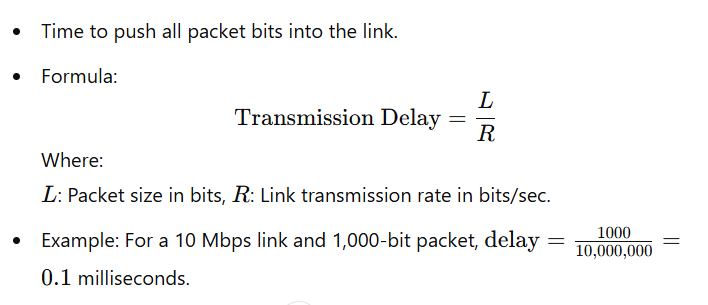

# Unit 1: Computer Networks and the Internet

# 1.1 The Internet
The Internet is a globally connected network system that facilitates communication and data services through a vast collection of private, public, business, academic, and government networks. It serves as a virtual infrastructure that links millions of computers and electronic devices worldwide, allowing users to exchange information seamlessly.

The Internet is decentralized, which means there is no central authority governing its operations. To enable communication between devices, the Internet relies on protocols and standards that govern how small units of data are formatted, addressed, and transmitted.

# 1.2 The Network Edge: Access Networks, Physical Media#

# The Network Edge:

- The network edge the connection or interface between a device or local network and the internet. The edge is close to the devices it is communicating with and is the entry point to the network. The network edge is a crucial security boundary that network administrators must provide solutions for. 
# Access Network:

- An access network is a type of network which physically connects an end system to the immediate router (also known as the “edge router”) on a path from the end system to any other distant end system.
These are the networks that connect end-users to the core of the internet, like DSL, cable, fiber, and wireless (Wi-Fi and cellular networks).

# Physical Media:
<li>Physical media are the backbone of network communication. From twisted pair cables to fiber optics, each type has unique characteristics that affect data transmission.
Physical media refers to the physical materials used to transmit data, such as copper wires, fiber-optic cables, and wireless radio frequencies.</li>

# 1.3 Network Core: Packet Switching and Circuit Switching 
# Packet Switching:
* Packet switching revolutionizes data transmission by breaking information into smaller units called packets. This method allows for efficient use of network resources, better scalability, and improved fault tolerance compared to traditional circuit switching.
 * Note: (Data is broken into packets, which are sent independently over the network and reassembled at the destination.)

# Circuit Switching:
* Circuit switching and packet switching are two fundamental approaches to data transmission in networks. Circuit switching establishes dedicated channels for communication, guaranteeing quality but potentially wasting resources. Packet switching breaks data into packets, sharing network resources efficiently but sacrificing guaranteed performance.

These methods have different strengths and weaknesses for various applications. Circuit switching excels in real-time communication like voice calls, while packet switching handles bursty data traffic more efficiently.
* Note: (A dedicated communication path is established between the sender and receiver for the duration of the transmission, traditionally used in telephone networks.)

# 1.4 Delay, Loss, and Throughput in Packet-Switched Network
* OverView:
* The internet connects distributed applications running on different systems.
* Ideal service: instantaneous, lossless, high-volume data transfer between systems.
* Reality: constraints like delay, loss, and throughput limitations exist.
* Understanding and managing these issues form a significant part of computer networking.

# Delay:
 Refers to the time it takes for data to travel from the source to the destination. This can include propagation, transmission, and queuing delays.

# Types of Delay in Packet-Switched Networks:

<h2>1. Processing Delay</h2>

* Time for a router to inspect the packet header, decide the next hop, and check for bit-level errors.
* Usually measured in microseconds.
* Minimal in high-speed routers.

<h2>2. Quering Delay</h2>

* Time spent waiting in a queue before transmission.
* Depends on traffic load:
* Low traffic: Little to no delay.
* Heavy traffic: Longer delays.
* Ranges from microseconds to milliseconds.

<h2>Transmission Delay </h2>

#  Loss: 
Packet loss in packet-switched networks occurs when data packets traveling across the network fail to reach their destination. This can happen for several reasons, including network congestion, hardware failures, and transmission errors. 
Packet loss is a critical factor that impacts network performance, particularly for applications requiring real-time data. Understanding the causes and implementing mitigation strategies helps minimize its effects, improving overall network reliability and user experience.

<h3>Note:</h3> 

* (Occurs when data packets fail to reach their destination due to network congestion or errors.)
* Common in overloaded queues.

#  Throughput: 
The rate at which data successfully travels through a network, usually measured in bits per second (bps)

<h3>Note:</h3>

* Amount of data transferred per second.
* Limited by the lowest bandwidth link on the path.

<h2>Factor Influencing Throguhput </h2>

<h3>1. Bandwidth </h3>

* The theoretical maximum rate at which data can be transmitted on a link. Higher bandwidth generally supports higher throughput.
<h3>2. Network Congestion </h3>

* Heavy traffic leads to queuing delays, packet loss, and retransmissions, reducing throughput.
<h3>3. Packet Loss and Retransmissions </h3>

* Lost packets in protocols like TCP trigger retransmissions, lowering throughput by consuming additional bandwidth.
<h3>4. Latency <h3>

* High latency due to propagation, processing, and queuing delays can reduce throughput, particularly in long-distance or high-delay networks.

<h3>5. Protocol Overhead </h3>

* Protocols like TCP and IP add headers to packets, which consume bandwidth and reduce effective throughput.

<h3>6. Hardware Limitations </h3>

* Processing speeds of routers and switches can limit the throughput of the network.

# 1.5 Protocol Layers and Their Service Models: Layered Architecture, Encapsulation
* In computer networking, the concept of protocol layers and service models is crucial for simplifying the complexity of communication between different systems. Networks are designed in a layered architecture to break down communication tasks into manageable sub-tasks, and encapsulation ensures that data is passed through the layers in a structured way.
* The most common and widely adopted layered architecture is the OSI (Open Systems Interconnection) model, which consists of seven layers, and the TCP/IP model, which uses four layers.

# OSI Model (7 layers):
* 1. Physical Layer (Layer 1):
    * Concerned with the transmission of raw bits over a physical medium (cables, wireless signals, etc.).
    * Defines the electrical, mechanical, and procedural characteristics.

* 2. Data Link Layer (Layer 2):
    * Responsible for node-to-node data transfer and error detection and correction.
    * Divided into two sub-layers: Media Access Control (MAC) and Logical Link Control (LLC).
    * Ensures that data frames are correctly transmitted across the physical link.

