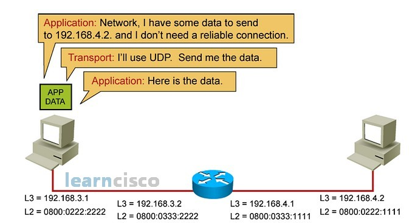
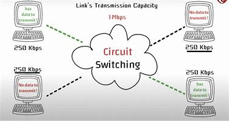

<h3># Unit 1: Computer Networks and the Internet </h3>

<h3>1.1 The Internet</h3>
The Internet is a globally connected network system that facilitates communication and data services through a vast collection of private, public, business, academic, and government networks. It serves as a virtual infrastructure that links millions of computers and electronic devices worldwide, allowing users to exchange information seamlessly.

The Internet is decentralized, which means there is no central authority governing its operations. To enable communication between devices, the Internet relies on protocols and standards that govern how small units of data are formatted, addressed, and transmitted.

<h3>1.2 The Network Edge: Access Networks, Physical Media</h3>

# The Network Edge:

- The network edge the connection or interface between a device or local network and the internet. The edge is close to the devices it is communicating with and is the entry point to the network. The network edge is a crucial security boundary that network administrators must provide solutions for. 
# Access Network:

- An access network is a type of network which physically connects an end system to the immediate router (also known as the “edge router”) on a path from the end system to any other distant end system.
These are the networks that connect end-users to the core of the internet, like DSL, cable, fiber, and wireless (Wi-Fi and cellular networks).

# Physical Media:
<li>Physical media are the backbone of network communication. From twisted pair cables to fiber optics, each type has unique characteristics that affect data transmission.
Physical media refers to the physical materials used to transmit data, such as copper wires, fiber-optic cables, and wireless radio frequencies.</li>

# 1.3 Network Core: Packet Switching and Circuit Switching 
# Packet Switching:
* Packet switching revolutionizes data transmission by breaking information into smaller units called packets. This method allows for efficient use of network resources, better scalability, and improved fault tolerance compared to traditional circuit switching.
 * Note: (Data is broken into packets, which are sent independently over the network and reassembled at the destination.)

# Circuit Switching:
* Circuit switching and packet switching are two fundamental approaches to data transmission in networks. Circuit switching establishes dedicated channels for communication, guaranteeing quality but potentially wasting resources. Packet switching breaks data into packets, sharing network resources efficiently but sacrificing guaranteed performance.

These methods have different strengths and weaknesses for various applications. Circuit switching excels in real-time communication like voice calls, while packet switching handles bursty data traffic more efficiently.
* Note: (A dedicated communication path is established between the sender and receiver for the duration of the transmission, traditionally used in telephone networks.)

