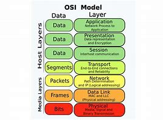
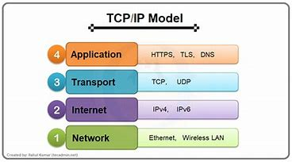

# Unit 1: Computer Networks and the Internet
* 1.1.The Internet
* 1.2.The Network Edge : Access Networks, Physical Media
* 1.3.The Network Core : Packet Switching, Circuit Switching
* 1.4.Delay,Loss,    and    Throughput    in    Packet-Switched Networks
* 1.5.Protocol  Layers  and  Their  Service  Models  :  Layered Architecture, Encapsulation
* 1.6.History of Computer Networking and the Internet

# 1.1 The Internet
The Internet is a globally connected network system that facilitates communication and data services through a vast collection of private, public, business, academic, and government networks. It serves as a virtual infrastructure that links millions of computers and electronic devices worldwide, allowing users to exchange information seamlessly.

The Internet is decentralized, which means there is no central authority governing its operations. To enable communication between devices, the Internet relies on protocols and standards that govern how small units of data are formatted, addressed, and transmitted.

# 1.2 The Network Edge: Access Networks, Physical Media#

# The Network Edge:

- The network edge the connection or interface between a device or local network and the internet. The edge is close to the devices it is communicating with and is the entry point to the network. The network edge is a crucial security boundary that network administrators must provide solutions for. 
# Access Network:

- An access network is a type of network which physically connects an end system to the immediate router (also known as the “edge router”) on a path from the end system to any other distant end system.
These are the networks that connect end-users to the core of the internet, like DSL, cable, fiber, and wireless (Wi-Fi and cellular networks).

# Physical Media:
<li>Physical media are the backbone of network communication. From twisted pair cables to fiber optics, each type has unique characteristics that affect data transmission.
Physical media refers to the physical materials used to transmit data, such as copper wires, fiber-optic cables, and wireless radio frequencies.</li>

# 1.3 Network Core: Packet Switching and Circuit Switching 
# Packet Switching:
* Packet switching revolutionizes data transmission by breaking information into smaller units called packets. This method allows for efficient use of network resources, better scalability, and improved fault tolerance compared to traditional circuit switching.
 * Note: (Data is broken into packets, which are sent independently over the network and reassembled at the destination.)

# Circuit Switching:
* Circuit switching and packet switching are two fundamental approaches to data transmission in networks. Circuit switching establishes dedicated channels for communication, guaranteeing quality but potentially wasting resources. Packet switching breaks data into packets, sharing network resources efficiently but sacrificing guaranteed performance.

These methods have different strengths and weaknesses for various applications. Circuit switching excels in real-time communication like voice calls, while packet switching handles bursty data traffic more efficiently.
* Note: (A dedicated communication path is established between the sender and receiver for the duration of the transmission, traditionally used in telephone networks.)

# 1.4 Delay, Loss, and Throughput in Packet-Switched Network
* OverView:
* The internet connects distributed applications running on different systems.
* Ideal service: instantaneous, lossless, high-volume data transfer between systems.
* Reality: constraints like delay, loss, and throughput limitations exist.
* Understanding and managing these issues form a significant part of computer networking.

# Delay:
 Refers to the time it takes for data to travel from the source to the destination. This can include propagation, transmission, and queuing delays.

# Types of Delay in Packet-Switched Networks:

<h2>1. Processing Delay</h2>

* Time for a router to inspect the packet header, decide the next hop, and check for bit-level errors.
* Usually measured in microseconds.
* Minimal in high-speed routers.

<h2>2. Quering Delay</h2>

* Time spent waiting in a queue before transmission.
* Depends on traffic load:
* Low traffic: Little to no delay.
* Heavy traffic: Longer delays.
* Ranges from microseconds to milliseconds.

<h2>Transmission Delay </h2>

#  Loss: 
Packet loss in packet-switched networks occurs when data packets traveling across the network fail to reach their destination. This can happen for several reasons, including network congestion, hardware failures, and transmission errors. 
Packet loss is a critical factor that impacts network performance, particularly for applications requiring real-time data. Understanding the causes and implementing mitigation strategies helps minimize its effects, improving overall network reliability and user experience.

<h3>Note:</h3> 

* (Occurs when data packets fail to reach their destination due to network congestion or errors.)
* Common in overloaded queues.

#  Throughput: 
The rate at which data successfully travels through a network, usually measured in bits per second (bps)

<h3>Note:</h3>

* Amount of data transferred per second.
* Limited by the lowest bandwidth link on the path.

<h2>Factor Influencing Throguhput </h2>

<h3>1. Bandwidth </h3>

* The theoretical maximum rate at which data can be transmitted on a link. Higher bandwidth generally supports higher throughput.
<h3>2. Network Congestion </h3>

* Heavy traffic leads to queuing delays, packet loss, and retransmissions, reducing throughput.
<h3>3. Packet Loss and Retransmissions </h3>

* Lost packets in protocols like TCP trigger retransmissions, lowering throughput by consuming additional bandwidth.
<h3>4. Latency <h3>

* High latency due to propagation, processing, and queuing delays can reduce throughput, particularly in long-distance or high-delay networks.

<h3>5. Protocol Overhead </h3>

* Protocols like TCP and IP add headers to packets, which consume bandwidth and reduce effective throughput.

<h3>6. Hardware Limitations </h3>

* Processing speeds of routers and switches can limit the throughput of the network.

# 1.5 Protocol Layers and Their Service Models: Layered Architecture, Encapsulation
* In computer networking, the concept of protocol layers and service models is crucial for simplifying the complexity of communication between different systems. Networks are designed in a layered architecture to break down communication tasks into manageable sub-tasks, and encapsulation ensures that data is passed through the layers in a structured way.
* The most common and widely adopted layered architecture is the OSI (Open Systems Interconnection) model, which consists of seven layers, and the TCP/IP model, which uses four layers.

# 1. OSI Model (7 layers):

* <b>1. Physical Layer (Layer 1): </b>
    * Concerned with the transmission of raw bits over a physical medium (cables, wireless signals, etc.).
    * Defines the electrical, mechanical, and procedural characteristics.

* <b> 2. Data Link Layer (Layer 2): </b>
    * Responsible for node-to-node data transfer and error detection and correction.
    * Divided into two sub-layers: Media Access Control (MAC) and Logical Link Control (LLC).
    * Ensures that data frames are correctly transmitted across the physical link.

* <b>3. Network Layer (Layer 3): </b>
    * Handles routing and forwarding of packets between different networks (inter-network communication).
    * Responsible for addressing and determining the best path for data transfer (e.g., using IP addresses).

* <b>4. Transport Layer (Layer 4): </b>
    * Provides end-to-end communication services for applications.
    * Ensures reliable data transfer with error control, flow control, and segmentation (e.g., TCP, UDP).

* <b>5. Session Layer (Layer 5): </b>
    * Manages sessions (or connections) between applications.
    * Handles the setup, maintenance, and termination of communication sessions.

* <b>6. Presentation Layer (Layer 6): </b>
    * Responsible for data translation, encryption, and compression.
    * Ensures that data sent by the application layer of one system can be understood by the application layer of another system.

* <b>7. Application Layer (Layer 7): </b>
    * The topmost layer where end-user applications interact with the network.
    * Provides services like email, file transfer, and web browsing (e.g., HTTP, FTP, DNS).

# * TCP/IP Model (4 Layers):

The TCP/IP model is a simplified version of the OSI model, used primarily in the internet and networking protocols:
* <b>Link Layer (Data Link + Physical in OSI)</b>
    * Handles the communication between devices on the same network.
    * Includes technologies like Ethernet, Wi-Fi, and ARP.
* Internet Layer (Network in OSI)</b>
    * Responsible for routing data across different networks using protocols like IP (Internet Protocol).
* <b>Transport Layer (Transport in OSI)</b>
    * Provides end-to-end communication between hosts, ensuring data is transferred reliably (e.g., TCP) or quickly without guarantees (e.g., UDP).
* <b>Application Layer (Application, Presentation, and Session in OSI)</b>
    * Handles high-level protocols for user applications, like HTTP, FTP, and DNS.

# 2. Service Models in Networking :
=> Each layer in a network model provides specific services to the layers above it and relies on services from the layers below it. These services define the function and role of each layer in the communication process. 
For example, the transport layer provides reliable or unreliable data transfer to the application layer, and the network layer provides routing and addressing services to the transport layer.

* <b> 1. Connection-Oriented vs. Connectionless Service:</b>
    * Connection-Oriented: A connection is established between sender and receiver before data transfer begins (e.g., TCP).
    * Connectionless: No need for establishing a connection; data is sent independently (e.g., UDP).

* <b> 2.Reliable vs. Unreliable Service:</b>
    * Reliable Service: Guarantees delivery of data with error detection and retransmission if necessary (e.g., TCP).
    * Unreliable Service: Data is sent without guarantees of delivery (e.g., UDP).

# 1.6 History of Computer Networking and the Internet:
=> The internet, as we know it today, is a massive network that has completely changed the way we communicate, work, learn, and connect with others. However, it didn’t start out this way. The idea of the internet began in the 1950s, during the World War, when researchers wanted to build a communication system that could survive disruptions, like attacks. What started as a small military project eventually grew into the global network we use today. The history of the internet is a story of creativity, teamwork, and the constant drive to stay connected, driven by fast technological progress and innovation.

# * Key Milestones in Internet History
* History of Internet: 
    * <b> 1969: Launch of ARPANET, the first operational packet-switching network.
    * <b> 1971: The first email is sent by Ray Tomlinson.
    * <b> 1983: Adoption of TCP/IP as the standard protocol for ARPANET.
    * <b> 1989-1990: Tim Berners-Lee invents the World Wide Web.
    * <b> 1993: The first graphical web browser, Mosaic, is released.
    * <b> 1998: Google is founded, revolutionizing search engines.
    * <b> 2007: The iPhone introduces widespread mobile Internet access.
    * <b> 2010s: Rise of cloud computing, social media, and streaming services.

# Practical Work: Wireshark Installation and Usage
* Installation of Wireshark (free packet sniffer app) and learn to use it

## Connect with me

