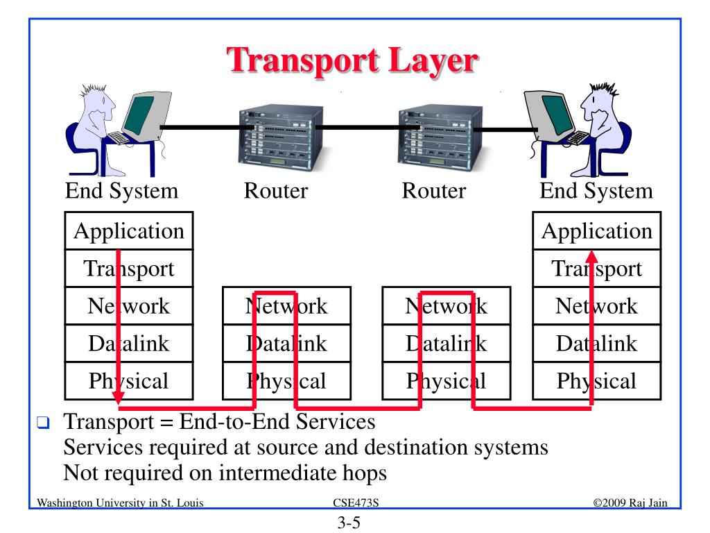

# Unit-3: Transport Layer
* 3.1.Introduction and Transport-Layer Services
    * 3.1.1.Relationship Between Transport and Network Layers
    * 3.1.2.Overview of the Transport Layer in the Internet
* 3.2.Multiplexing and De-multiplexing
* 3.3.Connectionless Transport: UDP
    * 3.3.1.UDP Segment Structure
    * 3.3.2.UDP Checksum
* 3.4.Principles of Reliable Data Transfer
    * 3.4.1.Go-Back-N (GBN)
    * 3.4.2.Selective Repeat (SR)
* 3.5.Connection-Oriented Transport: TCP
    * 3.5.1.Round-Trip Time Estimation and Timeout
    * 3.5.2.Reliable Data Transfer
    * 3.5.3.Flow Control
    * 3.6.TCP Congestion Control

<b>Practical Works: </b>

* Wireshark Lab: Exploring TCP and UDP

# Transport Layer Overview
The transport layer is responsible for delivering data between applications running on hosts. It offers services like reliable delivery, multiplexing, and congestion control. 
 
The transport layer bridges applications and the network. It provides services for process-to-process communication, enhancing the functionality of the underlying network layer.

# 3.1 Introduction and Transport-Layer Services
* Purpose: Provides communication between applications (e.g., web browsers, email).
* Services:
    * Multiplexing/Demultiplexing: Identifying which application should receive the data.
    * Reliable Data Transfer: Ensuring data is delivered correctly.
    * Flow Control: Prevents sender from overwhelming receiver.
    * Congestion Control: Avoids network overload.
# 3.1.1 Relationship Between Transport and Network Layers
* Network Layer: Responsible for host-to-host communication.
* Transport Layer: Ensures process-to-process delivery within hosts (uses network-layer services).

<b>Example:</b>

* A network layer delivers packets to the correct machine (IP address).
* The transport layer ensures that data is sent to the correct application (port).

# 3.1.2 Transport Layer in the Internet
<b>Two primary protocols:</b>

* TCP (Transmission Control Protocol): Reliable, connection-oriented.
    * Connection-oriented and reliable.
    * Used for applications requiring guaranteed delivery (e.g., file transfer, web browsing).

* UDP (User Datagram Protocol): Fast, connectionless.

    * Connectionless and faster but unreliable.
    * Commonly used for time-sensitive applications (e.g., video streaming, DNS).

# 3.2 Multiplexing and Demultiplexing
* <b>Multiplexing: </b>
    * Combining data from multiple applications into a single stream for transmission.
    * The sender combines data from multiple applications into a single transport-layer stream.
    * Uses source ports to identify originating applications.

* <b>Demultiplexing:</b>
    * Delivering received data to the correct application using port numbers.
    * The receiver separates incoming data streams and delivers them to the correct application.
    * Uses destination ports to identify target applications.
    <b> Port Numbers: </b>
    * Standardized identifiers for applications (e.g., HTTP: 80, HTTPS: 443, DNS: 53).

# 3.3 Connectionless Transport: UDP
* UDP: Lightweight, faster, but offers no reliability or congestion control.
* <b> Characteristics of UPD: </b>
    * No setup required before data transmission.
    * Lightweight: Minimal overhead.
    * No guarantee of delivery, order, or data integrity.
# 3.3.1 UDP Segment Structure
* Contains:
    * Source Port: Identifies the sending application.
    * Destination Port: Identifies the receiving application.
    * Length: Size of the UDP segment.
    * Checksum: Ensures data integrity.

# 3.3.2 UDP Checksum
=> A simple mechanism to detect errors in transmitted data.
* A basic error-checking mechanism.
* Detects data corruption but doesn’t correct it.

# 3.4 Principles of Reliable Data Transfer
Reliable data transfer ensures data is delivered accurately and in order.

# 3.4.1 Go-Back-N (GBN)
=> Sender can transmit multiple packets (window size).
If one packet is lost, all subsequent packets are retransmitted.
* <b>Operation </b>
    
    * Sender can send up to N packets without waiting for an acknowledgment (ACK).
    * If a packet is lost or corrupted, the receiver discards subsequent packets.
    * Sender retransmits the lost packet and all following packets.
# 3.4.2 Selective Repeat (SR)
=> Sender retransmits only the lost packets, not the entire sequence.
* <b>Operation </b>
    * Sender retransmits only the specific packets that were lost or corrupted.
    *Receiver uses a buffer to store packets that arrive out of order.
# 3.5 Connection-Oriented Transport: TCP
=> TCP establishes a connection before transmitting data. It ensures reliable and ordered delivery through mechanisms like acknowledgments and sequence numbers.
TCP is the cornerstone of reliable communication in the Internet.

# 3.5.1 Round-Trip Time (RTT) Estimation and Timeout
* Measures the time for a segment to travel to the receiver and back.
* Adjusts retransmission timeout dynamically based on RTT.
* Timeout:
    * Calculated dynamically based on RTT.
    * Ensures retransmissions occur only when necessary.
# 3.5.2 Reliable Data Transfer
Ensures data arrives at the receiver correctly using:
* Acknowledgments (ACKs).
* Sequence Numbers.
* Features: 
    * Sequence Numbers: Ensure data is reassembled in the correct order.
    * ACKs: Receiver confirms the successful delivery of data.
    * Retransmissions: Lost packets are resent.

# 3.5.3 Flow Control
Matches the sender’s transmission rate to the receiver’s capacity using the receiver’s window size.
* Purpose: Prevents the sender from overwhelming the receiver.
* Mechanism:
    * Receiver communicates its buffer size to the sender.
    * Sender adjusts its data rate to match the receiver’s capacity.
# 3.6 TCP Congestion Control
Prevents network congestion by adjusting the sender's data rate dynamically.TCP manages network congestion to maintain performance.

* Slow Start: Gradually increases data rate.
    * Initially sends a small amount of data (Congestion Window or CWND).
    * Gradually increases the data rate as ACKs are received.
* Congestion Avoidance: Avoids sending excessive data.
    * Once a threshold is reached, increases data rate more slowly to avoid congestion.
* Fast Retransmit: Quickly retransmits lost packets.
    * Quickly retransmits packets when multiple duplicate ACKs indicate a packet loss.

# Comparison of TCP and UDP
