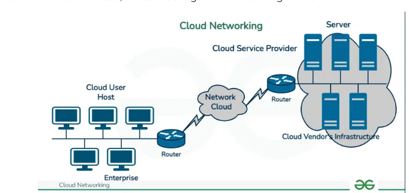

# DataCommunicationAndNetworks.456
BICTE 5th Sem Data Communication and Networks notes.

<h3>Computer Networking </h3>
	Computer networking is very important in modern technology, enabling the interconnected systems that power the Internet, business communications, and everyday digital interactions. Understanding the fundamentals of computer networking is essential for anyone involved in technology, from enthusiasts to professionals. This article will explore the basics of computer networking, including network types, components, protocols, and essential services like the Domain Name System (DNS).
<h3> What is a Computer Network? </h3>
A computer network is a collection of interconnected devices that share resources and information. These devices can include computers, servers, printers, and other hardware. Networks allow for the efficient exchange of data, enabling various applications such as email, file sharing, and internet browsing.

Networks can be as simple as connecting two computers in a home or as complex as linking thousands of computers across different continents in a large organization. Networks vary in size, structure, and purpose, and are generally categorized into types based on their scale and architecture.

<h3> How Does a Computer Network Work? <h3>
<h4>1.Building Blocks of a Computer Network: Nodes and Links</h4>
Nodes:

Nodes are essentially devices connected to the network.
They can be Data Communication Equipment (e.g., modems, routers) that help manage and transfer data.
Or Data Terminal Equipment (e.g., computers, printers) that send or receive data.

Links:
Links are the connections that allow nodes to communicate.
They can be physical, like wires or cables, or wireless, such as Wi-Fi or Bluetooth signals.
Visualize it as: Imagine each device (node) as a person in a room. The links are like ropes or open air between them, allowing each person to “speak” (communicate) with others.
<h4> 2.How Data Flows Throguh the Network </h4>
Each device (node) on the network has an IP Address.

Think of an IP Address as the unique “phone number” for each device, helping other devices identify and locate it on the network.

Data Communication Protocols:

These are the “rules” that govern how data should be sent and received.
The most common protocol suite is TCP/IP, which ensures data is packaged, sent, received, and reassembled correctly.
Visualize it as: Picture a letter being mailed. The IP address is the “address” on the envelope, while TCP/IP is the “postal system” that ensures the letter reaches the correct destination safely.

<h4>3. The Role of Nodes in Data Transmission </h4>
Routers: Direct data along the correct path to reach the destination device.
Modems: Convert data into signals that can be sent over a cable or wireless link.
Visualize it as: A router is like a traffic officer at an intersection, directing cars (data) to ensure they reach the correct destination.

<h4>How Devices Communicate Using Links </h4>
Devices send small data packets across the links (cables or wireless paths).
These packets travel between nodes, “hopping” from one to the next until they reach their final destination.
Visualize it as: Imagine a package delivery system where packets are small packages moving from one postal station (node) to the next until they arrive at the recipient's address. 

<h3> Types of Networks: </h3>
<ul>
<li><h3>LAN (Local Area Network): </h3>Covers a small area, like a home, office, or campus, and typically uses wired or wireless connections. </li>
<li><h3>WAN (Wide Area Network): </h3>Spans a large geographic area, such as cities or countries, and relies on connections like fiber optics, satellite, or the Internet.</li>
<li><h3>PAN (Personal Area Network): </h3>Connects devices in an individual's personal workspace (e.g., Bluetooth or USB connections between a phone and a laptop). </li>
<li><h3> Cloud Networks: </h3>Cloud Networking refers to the infrastructure and processes in the cloud computing environment that are involved in connecting and managing the network resources. It includes the design, deployment, and optimization of networks facilitating communication and data transfer between various services hosted on cloud platforms. Cloud networking facilitates organizations to establish secure, scalable, and high-performance network architectures following to their specific requirements</li>
<h3>Cloud Networking</h3>

</ul>

<h3> Basic Terminologies of Computer Networks</h3>

* Network: A network is a collection of computers and devices that are connected together to enable communication and data exchange.
* Nodes: Nodes are devices that are connected to a network. These can include computers, Servers, Printers, Routers, Switches, and other devices.
* Protocol: A protocol is a set of rules and standards that govern how data is transmitted over a network. Examples of protocols include TCP/IP, HTTP, and FTP.
* Topology: Network topology refers to the physical and logical arrangement of nodes on a network. The common network topologies include bus, star, ring, mesh, and tree.
* Service Provider Networks: These types of Networks give permission to take Network Capacity and Functionality on lease from the Provider. Service Provider Networks include Wireless Communications, Data Carriers, etc.
* IP Address: An IP address is a unique numerical identifier that is assigned to every device on a network. IP addresses are used to identify devices and enable communication between them.
* DNS: The Domain Name System (DNS) is a protocol that is used to translate human-readable domain names (such as www.google.com) into IP addresses that computers can understand.
* Firewall: A firewall is a security device that is used to monitor and control incoming and outgoing network traffic. Firewalls are used to protect networks from unauthorized access and other security threats.

## Connect with me

